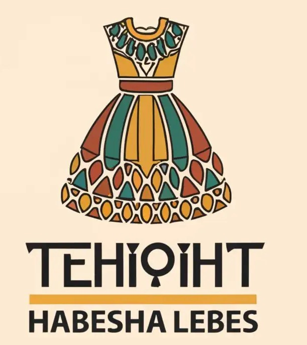

<p align="center">
  
</p>

<h1 align="center">Habesha Attire Detection</h1>

<p align="center">
   
  A deep learning project built in <strong>Jupyter Notebook</strong> using <strong>TensorFlow</strong> and <strong>Keras</strong> to identify Habesha traditional clothing from images.
</p>

---

##  Overview
This project focuses on detecting **Habesha traditional attire (Habesha libs)** from images using a **Convolutional Neural Network (CNN)**.  
It was created as part of my personal learning journey in computer vision and deep learning.

---

##  Dataset
I gathered around **1,000 images** of both Habesha and non-Habesha traditional clothes using the **Chrome Bulk Image Downloader** extension.  
The data was split into **training** and **validation** sets, with image augmentation applied to make the model more robust.

---

##  Tools & Libraries
- **TensorFlow / Keras** – Model building and training  
- **OpenCV (cv2)** – Image preprocessing  
- **scikit-learn** – Evaluation metrics (classification report, confusion matrix)  
- **Matplotlib** – Visualization of accuracy and loss  
- **ImageDataGenerator** – Data augmentation (rotation, shift, zoom, flip, etc.)

---

##  Installation Guidelines

```bash
pip install tensorflow
```
```bash
pip install opencv-python
```
```bash
pip install scikit-learn
```
```bash
pip install matplotlib
```

---

##  Model Summary
The CNN includes:
- 3 Convolutional layers (with ReLU and MaxPooling)  
- 1 Fully connected layer with dropout for regularization  
- 1 Sigmoid output layer for binary classification  

**Compilation Details:**  
- Optimizer: `Adam`  
- Loss: `Binary Crossentropy`  
- Metrics: `Accuracy`

---

##  Results
After 20 epochs of training:

| Metric | Value |
|--------|--------|
| **Validation Accuracy** | **71%** |
| **Precision (Habesha Libs)** | 0.73 |
| **Recall (Habesha Libs)** | 0.80 |
| **F1-Score** | 0.76 |

The model performs decently, showing it has learned general visual patterns of Habesha attire.

---

##  Limitations
The model sometimes **confuses white suits and other cultural white attires (like Indian traditional clothing)** with Habesha clothes.  
This is mainly because my dataset lacked enough variation in non-Habesha white clothing.

---

##  Future Plans
To improve the model:
- Expand the dataset with more white traditional attires from other cultures  
- Train the model on **diverse backgrounds** and lighting  
- Possibly fine-tune with **transfer learning (e.g., VGG16 or MobileNet)** for better feature extraction  

---

##  Reflection
This was a hands-on learning experience in:
- Image collection and preprocessing  
- CNN architecture design  
- Evaluating and improving model performance  

It’s a solid foundation that I plan to build upon in my AI/ML journey.

---

##  Links
- **Live Demo:** [Hugging Face Space](https://huggingface.co/spaces/YordanosTefera/habesha-attire-detection)  
- **LinkedIn:** [Yordanos Tefera](https://www.linkedin.com/in/yordanosgtefera/)

---
<div style="background-color:red;">Test</div>
<p align="center">
  <br/>
  <strong>Thank you for checking out my project!</strong>
</p>